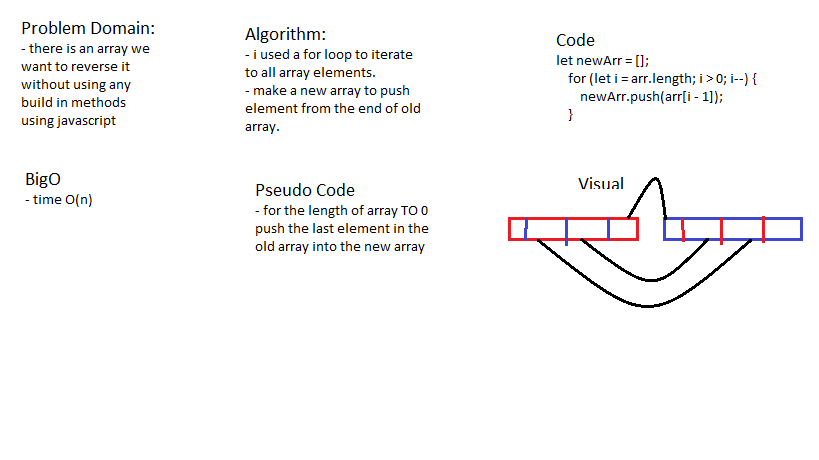

# data-structures-and-algorithms

# Reverse an Array

### Reverse an array elements to make the last element in the beggining .

## Challenge

### Reverse an array without using any build in methods.

## Approach & Efficiency

### i used a for loop to iterate the elements in array and it takes O(n)

## Solution

