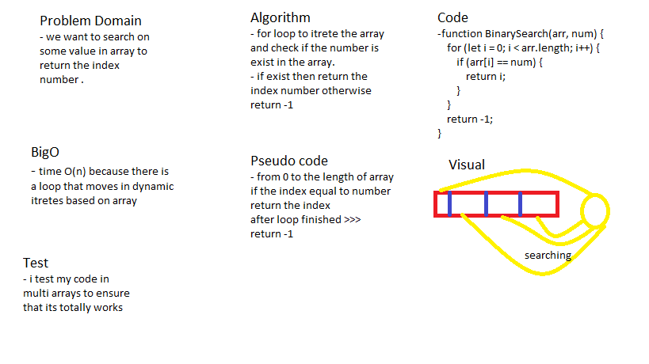

# Array Binary Search

### search about a number inside an array.

## Challenge

### search for a number inside an array without using any build in methods.

## Approach & Efficiency

### i used a for loop to iterate the elements in array and it takes O(n) because there is a loop with dynamic iterates .

## Solution

