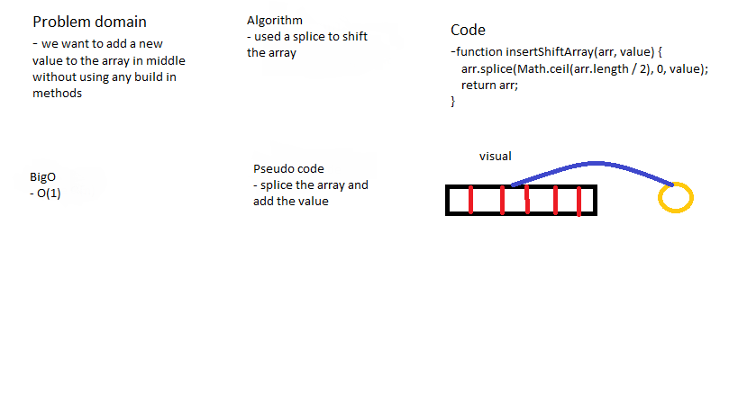

# Array Shift

### shift the elements of array to the right to add a value in middle .

## Challenge

### shift the array elements without using any build in methods.

## Approach & Efficiency

### i used a for loop to iterate the elements in array and it takes O(1) because the complexity is static value .

## Solution

## Test

### i used a different arrays and its worked because its dynamic .
