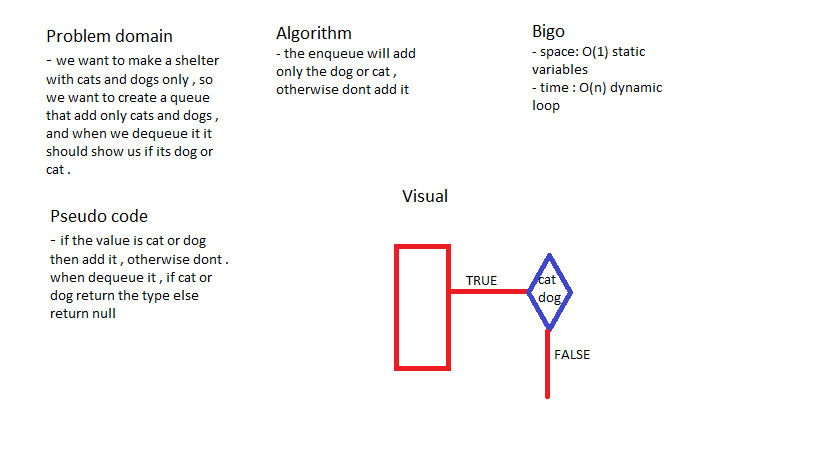

# Animal shelter queue

### create a queue to add a cats or dogs  .

## Challenge

### create a queue that added cats or dogs only , otherwise dont add anything. 

## Approach & Efficiency

### i used a basic methods to check if the value is cat or dog and then push it in a array.

## Solution

## Test

### i used jest package to test my code with 2 tests (npm run test --linked-list.test.js) . 
