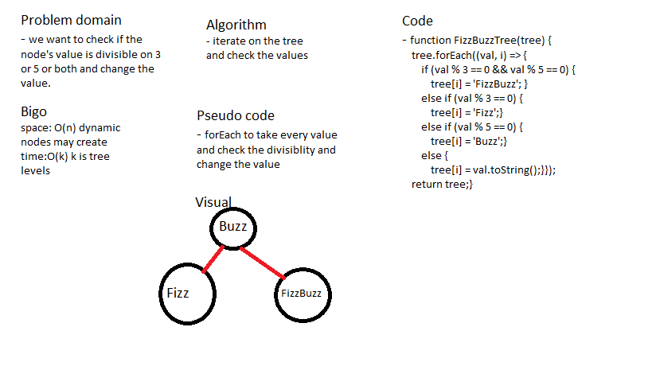

# Fizz Buzz Tree

### create a Fizz Buzz tree .

## Challenge

### create a Fizz Buzz tree that change the value of nodes based on divisiblity of the value . 

## Approach & Efficiency

### i used a node class and use it in a binary tree class . the ready tree send it to fizz buzz function that change on values .

## Solution

## Test

### i used jest package to test my code with 1 test (npm test -- fizzbuzztree.test.js) . 