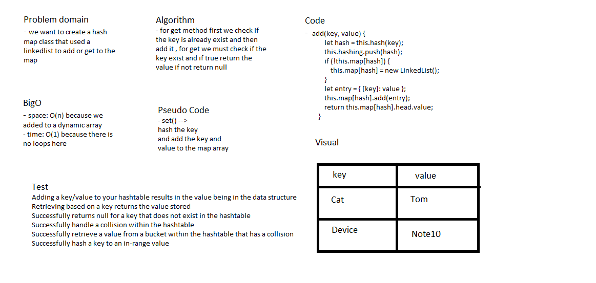

# Hash Map

### create a Hash Map .

## Challenge

### create a Hash Map class that hashed , add , get and search for a value if its exist in collection or not . 

## Approach & Efficiency

### i used a Node , Linkedlist and HashMap classes to can use a hashing .

## Solution

## Test

### i used jest package to test my code with 4 tests (npm run test --hashMap.test.js) . 
