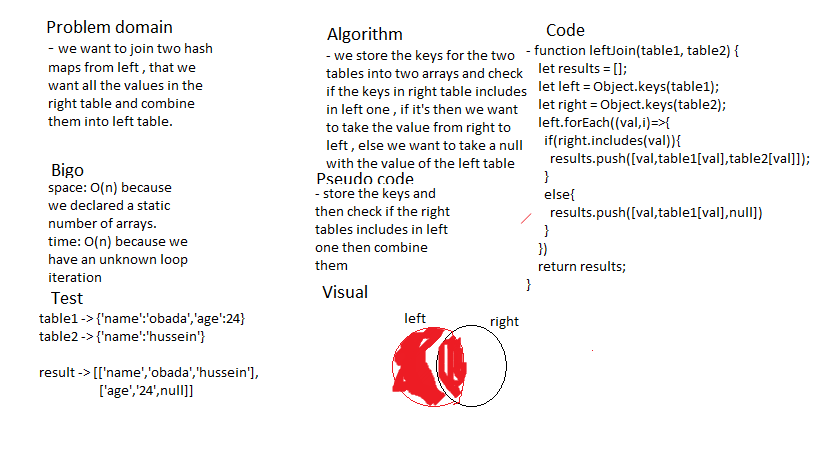

# Left Join

### create a Left join .

## Challenge

### create a Left Join for hash tables . 

## Approach & Efficiency

### i used a function that accept two tables and return an array of arrays

## Solution

## Test

### i used jest package to test my code with 2 tests (npm test -- leftJoin.test.js) . 