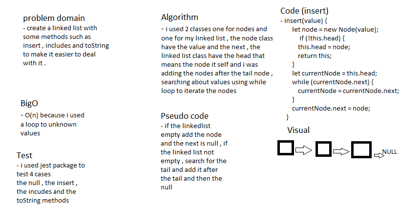

# LinkedList

### create a singly linkedlist .

## Challenge

### create a linked list with inertion , searching and converting methods.

## Approach & Efficiency

### i used a basic methods to iterate to all nodes in linked list.

## Solution

## Test

### i used jest package to test my code with 4 tests (npm run test --linked-list.test.js) . 
