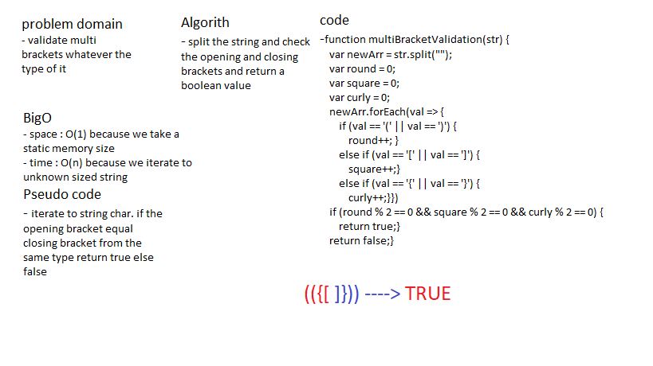

# Bracket Validation

### create a function to validate multi Bracket .

## Challenge

### Create a function that validate multi Bracket with any string added .

## Approach & Efficiency

### i used a basic methods to validate multi Bracket with any string added .

## Solution

## Test

### i used jest package to test my code with 2 tests (npm test -- multiBracketValidation.test.js) . 