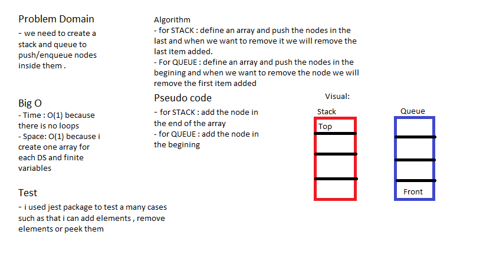

# Queue and Stack

### Create a Queue using Stacks mwthods .

## Challenge

### using a data structure i built a queue and stack with a correct standard .

## Approach & Efficiency

### i used class for each one and every class have methods that help us to add or remove or many stuff to do.

## Solution

## Test

### i used jest package to test many cases such as :

1- Can successfully Enqueue onto a Queue

2- Can successfully Enqueue multiple values onto a Queue

3- Can successfully Dequeue off the stack

4- Can successfully empty a queue after multiple Dequeues

5- Can successfully peek the next item on the Queue

6- Can successfully instantiate an empty Queue

7- Calling Dequeue or peek on empty queue raises exception