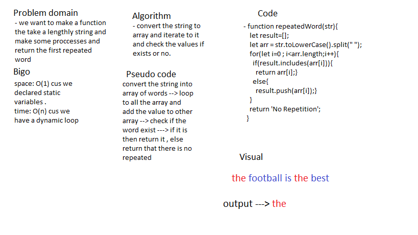

# Repeated Word

### return the first repeated word in the string.

## Challenge

### return the first repeated word in the string without use advance buit in methods . 

## Approach & Efficiency

### i used a function that accept a string and return the first repeated word .

## Solution

## Test

### i used jest package to test my code with 3 tests (npm run test --repeatedWord.test.js) . 
