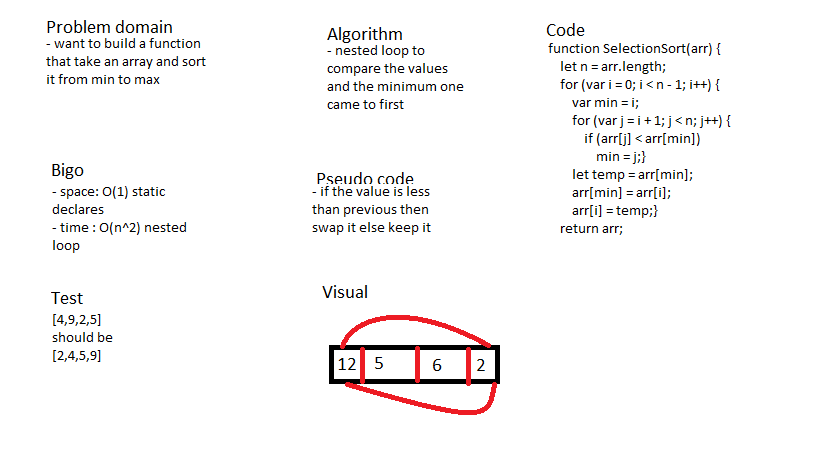

# selection Sort

### create a selection sort .

## Challenge

### create a selection sort from a Pseudocode and write down the result step by step . 

## Approach & Efficiency

### i used a functioon that accept an array and sort it , and i write the process that happened

## Solution

## Test

### i used jest package to test my code with 2 tests (npm test -- selectionSort.test.js) . 