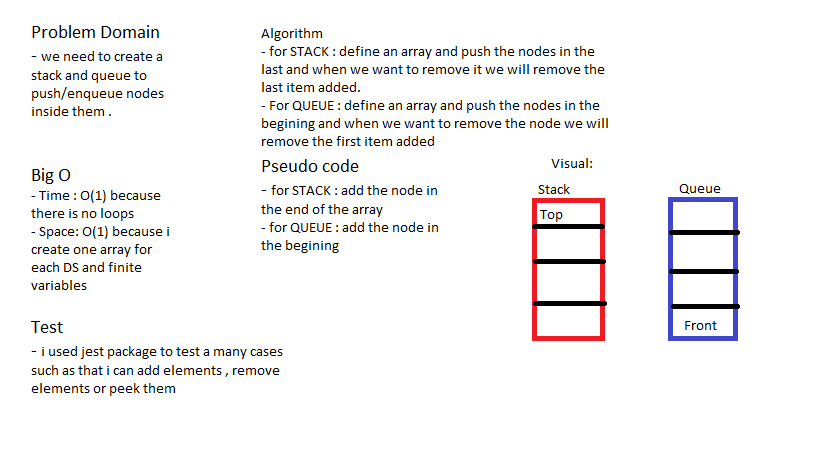

# Queue and Stack

### Create a stack and queue that i can add , remove and peek nodes into them .

## Challenge

### using a data structure i built a queue and stack with a correct standard .

## Approach & Efficiency

### i used class for each one and every class have methods that help us to add or remove or many stuff to do.

## Solution

## Test

### i used jest package to test many cases such as :

1- Can successfully push onto a stack

2- Can successfully push multiple values onto a stack

3- Can successfully pop off the stack

4- Can successfully empty a stack after multiple pops

5- Can successfully peek the next item on the stack

6- Can successfully instantiate an empty stack

7- Calling pop or peek on empty stack raises exception