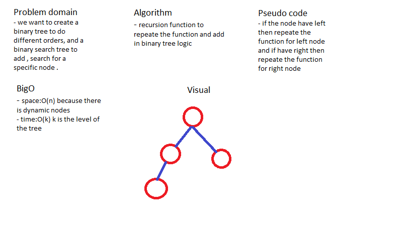

# Binary Tree

### create a Binary tree .

## Challenge

### create a Binary tree and do a binary search tree to add and search for a value. 

## Approach & Efficiency

### i used a node class and use it in a binary tree class . using recursion functions to repeate the algorithm.

## Solution

## Test

### i used jest package to test my code with 3 tests (npm test -- tree.test.js) . 