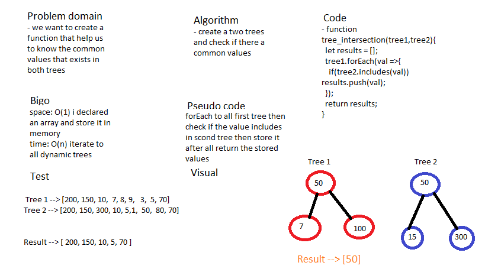

# Tree Intersection 

### return a set of values found in both trees.

## Challenge

### return a set of values found in both trees without use advance built in methods . 

## Approach & Efficiency

### i used a function that accept a two arrays and return a set of values found in both trees. .

## Solution

## Test

### i used jest package to test my code with 3 tests (npm run test --treeIntersection.test.js) . 